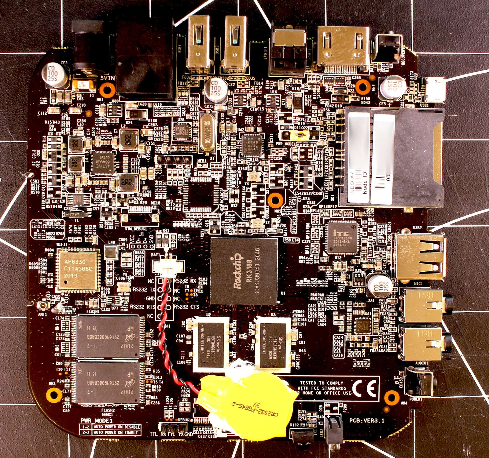
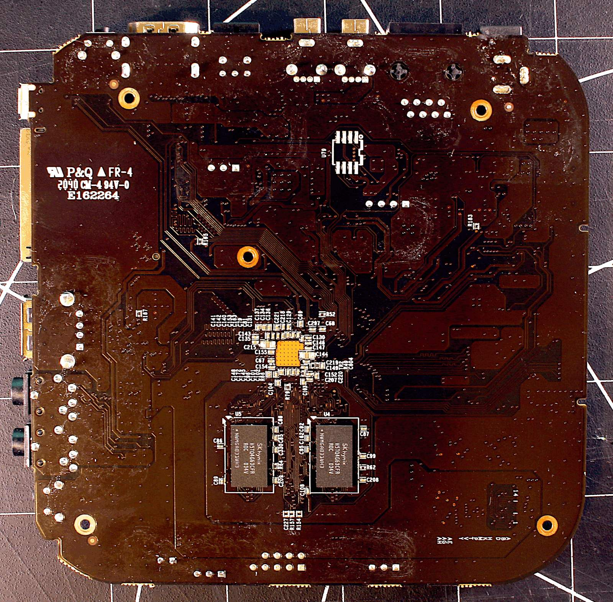

# debian_minix_neo_x7
Debian auf minix NEO X7

## technische Daten

  
  

## Quellen

### Anleitungen

### Downloads / Repositories
  - **Bootloader:** https://github.com/neo-technologies/rockchip-bootloader/
    
